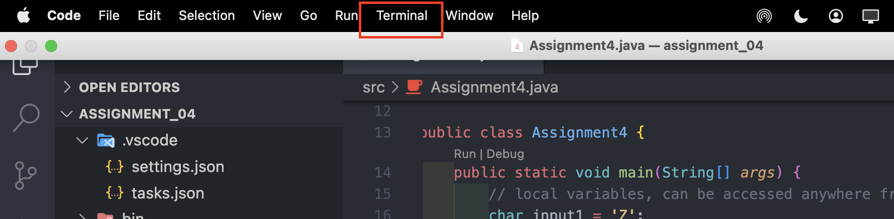
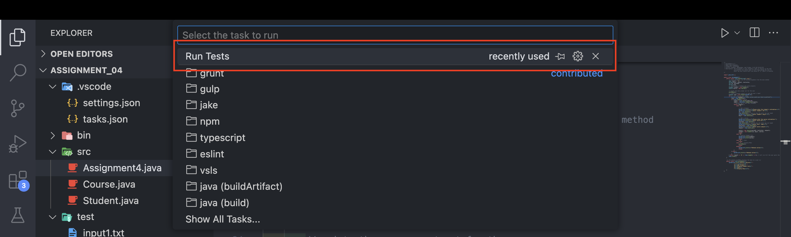
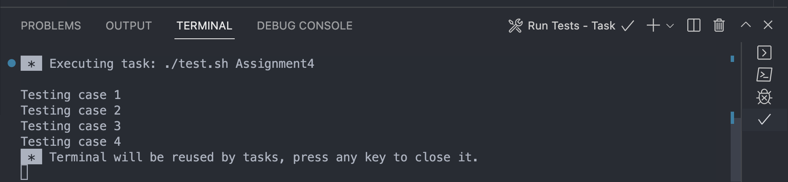
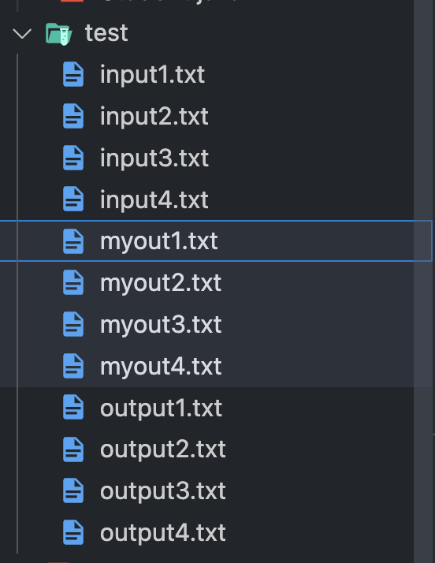
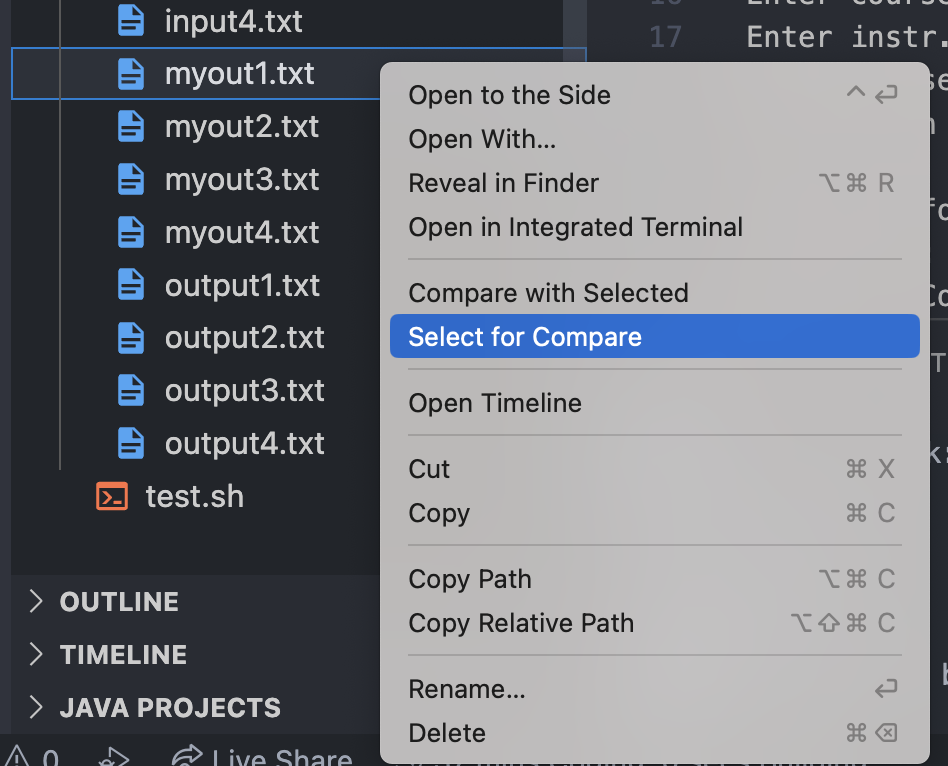
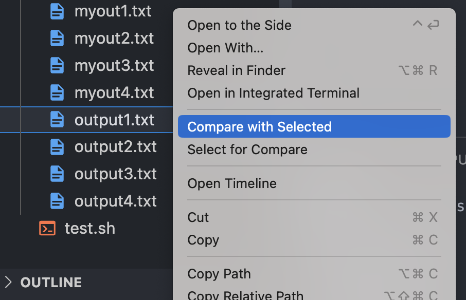
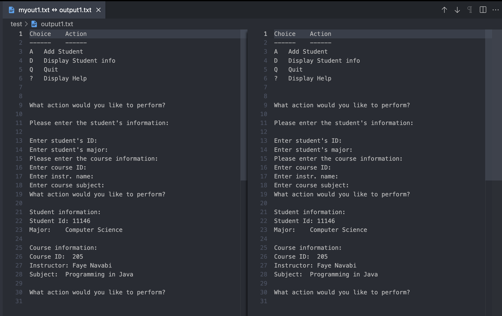
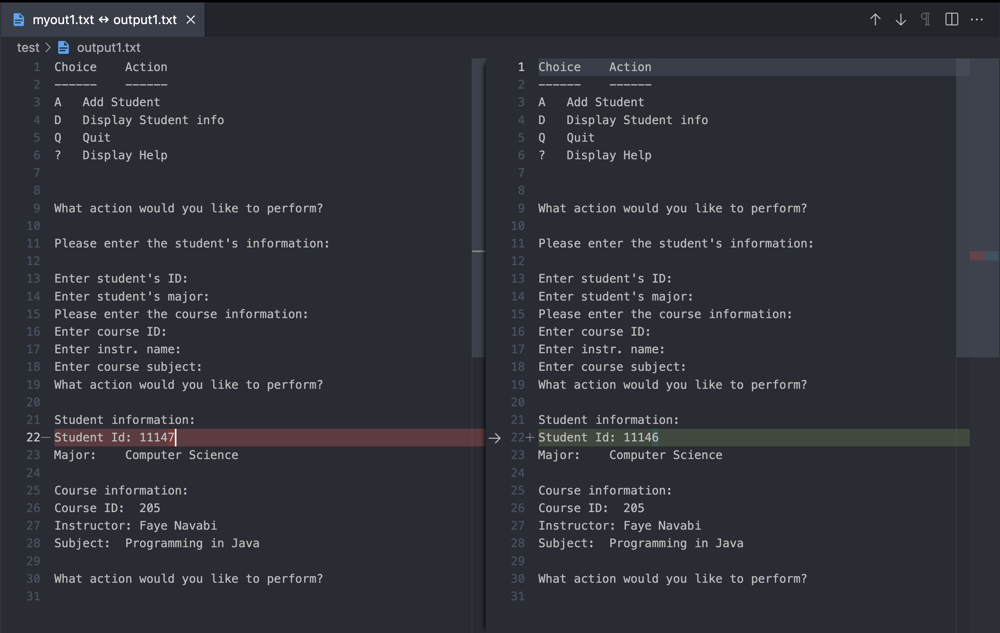

# **Arizona State University CSE 205 - Visual Studio Code Assignment Boilerplate**

This is a boilerplate template for CSE205 console assignments to allow for MacOS users to use test cases in Visual Studio Code for Java development.

> NOTE: You CAN delete the `.gitignore` file in the `bin`, `src`, and `test` folder directories. As they are only included so that git will allow for these directories to be pushed to Github, as empty directories are ignored in git because they have no content in them and git only reads directories that have content within them.

## Requirements

- [Extension Pack for Java](https://marketplace.visualstudio.com/items?itemName=vscjava.vscode-java-pack)

## Directions to set up test cases in Visual Studio Code for MacOS users

### `.vscode` Folder

- If you don’t already have a `.vscode` folder, create one.
- You should have two files in `.vsode`
  1.) `settings.json`
  ```json
  {
    "java.project.sourcePaths": ["src"], // Source folder
    "java.project.outputPath": "bin" // Output folder
  }
  ```
  2.) `tasks.json`
  ```json
  {
    "version": "2.0.0",
    "tasks": [
      {
        "label": "Run Tests",
        "type": "shell",
        "command": "./test.sh ${fileBasenameNoExtension}",
        "problemMatcher": [],
        "group": {
          "kind": "build",
          "isDefault": true
        }
      }
    ]
  }
  ```

### `bin` folder

- Create a `bin` folder, this folder should hold all of your .class file. When you run the `Java: Run Tests` it will make them automatically

### `src` folder

- Create a `src` folder and it should hold all you `.java` files

### `test` folder

- Create a `test` folder and it should hold all you input an output files
- will output all your myoutput files into this folder for you to compare with.

### `test.sh` file

- in the `test.sh` file, paste this code:

```bash
  #!/bin/bash
for ((i=1; i<=4; i++)) do # Loops through the 4 test cases, might need to change the number depending on how many test cases you have
    echo "Testing case $i" # prints which test case number it's currently testing

    # Compiles the java file and runs it with the input file and outputs the result to myout$i.txt(depends on which test case it's currently testing)
    java -cp bin/ $1 < test/input$i.txt > test/myout$i.txt
    diff test/myout$i.txt test/output$i.txt
done
```

- Keep in mind that depending on how many test cases the assignment has, you might have to change the `4` in the for loop to fit the assignment’s needs.

- Keep in mind that depending on how many test cases the assignment has, you might have to change the `4` in the for loop to fit the assignment’s needs.

## Directions for running the test cases

You can run all test cases by going to the `Terminal` > `Run Task...` while the tab with your main class is selected and choosing `"Run Tests”`






### Results

### Should see this in your Terminal



### These files should be made in your folder for you to compare with the given expected output files.



### Directions on comparing files

1.) double-click(aka right-click) on the file created when you ran `Run Tests`, then select `Select for Compare`



2.) From there, double-click on the output.txt file that corresponds with the file you selected in step 1 and click on `Compare with Selected`



3.) From there if you have no error, you will just see two identical files(like the image top). But if error show(like the image on the bottom), they will be highlighted for you to see and you can debug the errors from there.




